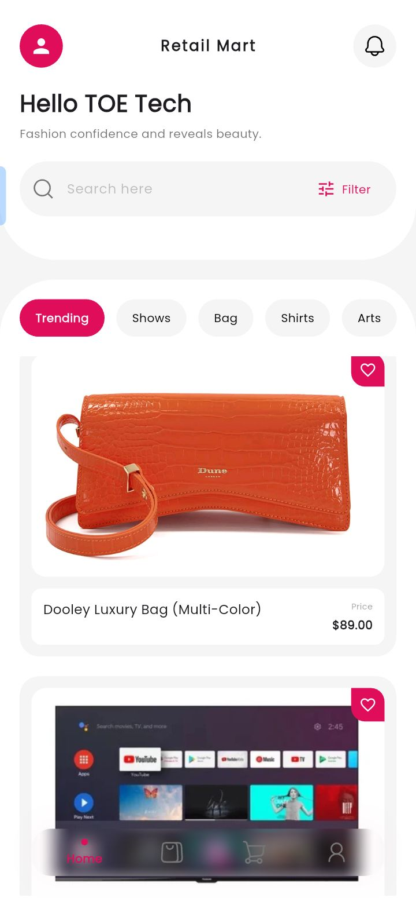

# Retail Mart - Flutter E-commerce App

A beautiful e-commerce Flutter application with three screens: Home, Product Details, and Cart.

## Features

- **State Management**: Riverpod for efficient state management
- **Navigation**: Go Router for declarative routing
- **API Integration**: Dio for HTTP requests (ready to integrate with your backend)
- **Responsive UI**: Clean, modern design matching the provided mockups
- **Cart Functionality**: Add to cart, remove items, checkout flow

## Project Structure

```
lib/
├── main.dart                          # App entry point
├── models/
│   ├── product.dart                   # Product model
│   └── cart_item.dart                 # Cart item model
├── providers/
│   ├── products_provider.dart         # Product state management
│   └── cart_provider.dart             # Cart state management
├── router/
│   └── app_router.dart                # Go Router configuration
├── screens/
│   ├── home_screen.dart               # Home screen with product list
│   ├── product_detail_screen.dart     # Product details screen
│   └── cart_screen.dart               # Shopping cart screen
└── services/
    └── api_service.dart               # Dio API service
```

## Setup Instructions

### 1. Install Dependencies

```bash
flutter pub get
```

### 2. Run the App

```bash
flutter run
```

### 3. API Integration

The app is configured to work with mock data by default. To integrate with your backend:

1. Update the `baseUrl` in `lib/services/api_service.dart`:
```dart
baseUrl: 'https://your-api-url.com',
```

2. Uncomment the API calls in `lib/providers/products_provider.dart`:
```dart
final apiService = ref.watch(apiServiceProvider);
final data = await apiService.getProducts();
return data.map((json) => Product.fromJson(json)).toList();
```

## Screens

### 1. Home Screen (`/home`)
- Product grid display
- Category filters (Trending, Shows, Bag, Shirts)
- Search functionality
- Bottom navigation



### 2. Product Detail Screen (`/product/:id`)
- Product image with thumbnails
- Size selection
- Color selection
- Quantity selector
- Add to cart / Buy now buttons

### 3. Cart Screen (`/cart`)
- Cart items list
- Subtotal, delivery fee, and total calculation
- Remove items from cart
- Checkout button

## State Management

### Products Provider
```dart
ref.watch(productsProvider)           // Get all products
ref.watch(selectedCategoryProvider)    // Get/set selected category
```

### Cart Provider
```dart
ref.watch(cartProvider)                           // Get cart items
ref.read(cartProvider.notifier).addToCart()       // Add item to cart
ref.read(cartProvider.notifier).removeFromCart()  // Remove item
ref.read(cartProvider.notifier).clearCart()       // Clear cart
ref.watch(cartTotalsProvider)                     // Get cart totals
```

## Navigation

```dart
context.go('/')                                    // Navigate to home
context.pushNamed('product-detail', extra: product) // Navigate to product
context.pushNamed('cart')                          // Navigate to cart
context.pop()                                      // Go back
```

## API Endpoints

The `ApiService` class provides the following methods:

```dart
apiService.getProducts(category: 'Trending')  // Get products by category
apiService.getProductById('123')              // Get single product
apiService.createOrder(orderData)             // Create order
```

## Customization

### Colors
The app uses a custom color scheme with primary color `#E00D5B`. Update in `lib/design_system/tokens/colors.dart`:


### Fonts
The app uses default flutter font. Change in `lib/design_system/tokens/typography.dart`:


## Dependencies

```yaml
dependencies:
  flutter_riverpod: ^2.4.9      # State management
  riverpod_annotation: ^2.3.3   # Code generation for Riverpod
  go_router: ^13.0.0            # Routing
  dio: ^5.4.0                   # HTTP client
  google_fonts: ^6.1.0          # Custom fonts
```

## Building for Production

### Android
```bash
flutter build apk --release
```

### iOS
```bash
flutter build ios --release
```

## Notes

- The app currently uses mock data for demonstration
- Product images are placeholders (icons) - replace with actual images
- Add your API URL in `api_service.dart`
- Implement authentication if required
- Add payment gateway integration for checkout


## License

MIT License
